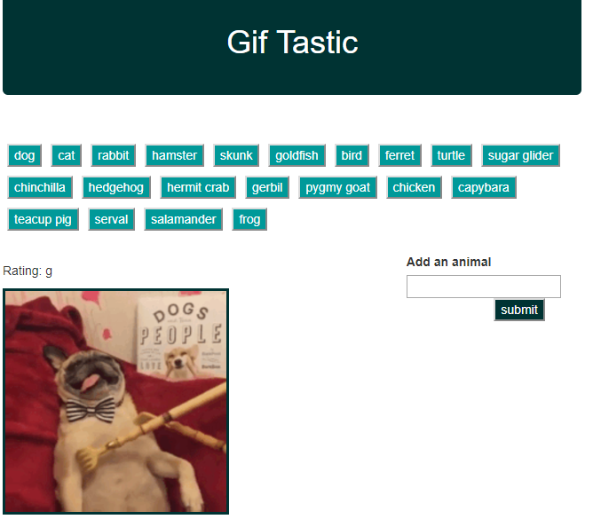
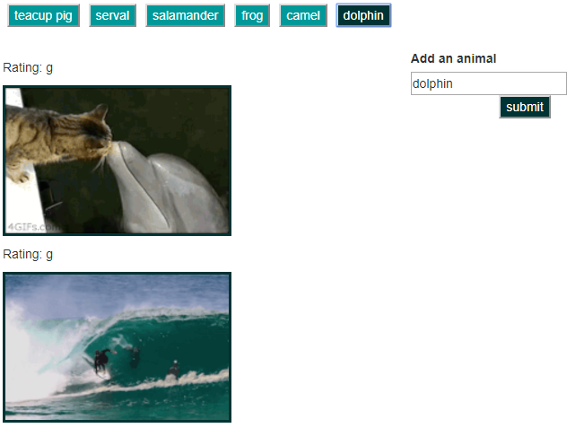

# GifTastic

This app uses the GIPHY API to populate with gifs of user choice (animals in this app). 

When the user clicks on a button, the page grabs 10 static, non-animated gif images from the GIPHY API and place them on the page.

When the user clicks one of the still GIPHY images, the gif animates. If the user clicks the gif again, it stops playing.

Above every gif, there is rating (PG, G, so on).

This page takes the value from a user input box and adds it in form of button into the list. 

